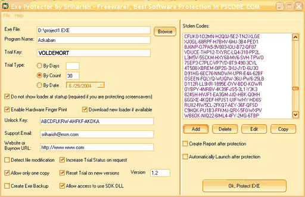



## CONVERT EXE FILES TO SHAREWARE VERSIONS\-now supports VB, VC\+\+, Flash,\.NET, MASM and Screensavers

### Description

*UPDATED*.The BEST SOFTWARE PROTECTION YOU CAN EVER FIND IN PSCODE.COM.This isn't any rubbish submission. This is nearly as good as commercial software protection.This is really a good software protection ever made in planetsourcecode.com.The program uses MEMORY techniques to directly embed your EXE into the MEMORY and works with any VB EXE (PE). This code comes with a LOADER written in VB which has protection just like any other commercial software protection like DEBUG DETECTION, ANTI MONITORING and DUMPING, suspecious activity detection, BLACK LISTED CODES, FAKE MEMORY INJECTION, ADVANCED TAMPER DETECTION SYSTEM etc. The trial system is also very secure and it is manually IMPOSSIBLE to revert the trial settings. In EXE PROTECTOR you have to select many settings like the trial type, key generation, black listed codes, key maker password, etc, then your software is automatically converted to the trial version according to the settings made. The Key generation uses a Triple Key DES Encryption with SHA which is good. The loader is extremely fast, it is tested under different conditions and it works pretty well.There are many customisable options like you can choose to give FREE UPDATES for minor versions of your software, reset trial on new versions, add BUY NOW URL's, increase trial count by request and more.This submission took many days to build and test before submission. The code is excactly as secure as other software protectors and my submission is a freeware. If you need more help you can refer the very extensive documentation and sample project. Easily generate XML based reports and save projects for future use.Inspite of repeated requests, i'm submitting this code as a FREEWARE. A vote- thats all i need.
 
### More Info
 

             |
---                |---
**Submitted On**   |2004-07-22 15:42:02
**By**             |[Sriharish\.H](https://github.com/Planet-Source-Code/PSCIndex/blob/master/ByAuthor/sriharish-h.md)
**Level**          |Advanced
**User Rating**    |4.8 (579 globes from 120 users)
**Compatibility**  |VB 6\.0
**Category**       |[Complete Applications](https://github.com/Planet-Source-Code/PSCIndex/blob/master/ByCategory/complete-applications__1-27.md)
**World**          |[Visual Basic](https://github.com/Planet-Source-Code/PSCIndex/blob/master/ByWorld/visual-basic.md)
**Archive File**   |[CONVERT\_EX177641812004\.zip](https://github.com/Planet-Source-Code/sriharish-h-convert-exe-files-to-shareware-versions-now-supports-vb-vc-flash-net-masm-and-__1-55284/archive/master.zip)

